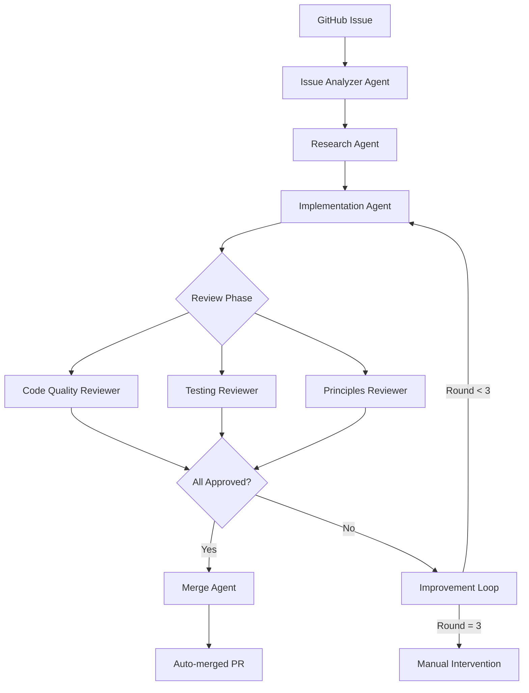

# 🤖 Multi-Agent Issue Resolver

An intelligent orchestration system inspired by GPT-Researcher that automatically resolves GitHub issues using multiple specialized agents, following SOLID, DRY, KISS, and YAGNI principles.

## 🌟 Features

- **Multi-Agent Architecture**: Specialized agents for analysis, research, implementation, and review
- **Iterative Review System**: 3 rounds of automated review with improvements
- **Best Practices Research**: Uses Tavily for finding current best practices
- **Intelligent Implementation**: GPT-5 powered code generation following principles
- **Automated Testing**: Generates and validates tests
- **Auto-merge on Success**: Creates PR and merges if all reviews pass

## 🏗️ Architecture



## 📦 Components

### 1. **Issue Analyzer Agent**
- Parses GitHub issue details
- Creates implementation plan
- Sets up feature branch

### 2. **Research Agent**
- Searches for best practices using Tavily
- Researches similar implementations
- Synthesizes findings with GPT-5

### 3. **Implementation Agent**
- Writes code based on research and plan
- Follows existing patterns in codebase
- Adheres to SOLID/DRY/KISS/YAGNI

### 4. **Review Agents**

#### Code Quality Reviewer
- Checks readability and clarity
- Validates error handling
- Ensures performance considerations

#### Testing Reviewer
- Verifies test coverage (min 70%)
- Checks edge cases
- Runs existing tests

#### Principles Reviewer
- Validates SOLID principles
- Checks for DRY violations
- Ensures KISS compliance
- Prevents YAGNI violations

### 5. **Merge Agent**
- Creates pull request
- Sets up auto-merge
- Documents review results

## 🔄 Review Loop System

The system implements an iterative review process:

1. **Round 1**: Initial implementation review
2. **Round 2**: Apply improvements based on feedback
3. **Round 3**: Final review after refinements

Each round includes:
- Code quality scoring (0-100)
- Test coverage analysis
- Principles adherence check
- Intelligent refactoring if needed

## 🚀 Usage

### Prerequisites

```bash
# Install GitHub CLI
brew install gh  # macOS
# or see: https://cli.github.com/

# Install Python 3
brew install python3

# Configure GitHub CLI
gh auth login

# Install CLI tools (if available)
# gpt5 and tavily commands
```

### Basic Usage

```bash
# Resolve a specific issue
./automation/run_resolver.sh 70

# The script will:
# 1. Analyze issue #70
# 2. Research solutions
# 3. Implement fix
# 4. Review (3 rounds)
# 5. Create PR and merge if approved
```

### Python API

```python
from issue_resolver import IssueResolverOrchestrator

orchestrator = IssueResolverOrchestrator()
success = await orchestrator.resolve_issue(issue_number=70)
```

## ⚙️ Configuration

Edit `agent_config.yaml` to customize:

```yaml
agents:
  analyzer:
    effort_level: medium  # low/medium/high
  
  researcher:
    search_depth: advanced
    max_results: 5

workflow:
  review_rounds: 3
  max_iterations: 5
  timeout_minutes: 30

review_criteria:
  code_quality:
    min_score: 80
  testing:
    min_coverage: 70
  principles:
    strict_mode: true
```

## 🛡️ Safety Features

- **Backup Branch**: Creates backup before changes
- **Rollback on Failure**: Reverts changes if reviews fail
- **Manual Confirmation**: Requires user approval before starting
- **Limited Scope**: Only works on labeled issues
- **File Change Limits**: Max 10 files, 500 lines

## 📊 Success Criteria

For automatic merge, ALL of the following must pass:

- ✅ Code Quality Score ≥ 80/100
- ✅ Test Coverage ≥ 70%
- ✅ Principles Score ≥ 85/100
- ✅ All existing tests pass
- ✅ No security vulnerabilities

## 🔍 Review Reports

Each resolution generates a detailed report:

```markdown
# Review Cycle Report

## Round 1
**Status**: changes_requested
**Scores**:
  - Code Quality: 75/100
  - Test Coverage: 60%
  - Principles: 80/100
**Improvements Made**:
  - Added error handling
  - Generated unit tests

## Round 2
**Status**: approved
**Scores**:
  - Code Quality: 85/100
  - Test Coverage: 75%
  - Principles: 90/100

## Final Status: ✅ APPROVED
```

## 🚫 Limitations

The system will NOT handle:
- Security-critical issues
- Breaking changes
- Database migrations
- External API credentials
- Issues requiring human judgment

## 🔧 Troubleshooting

### Issue: "gpt5 command not found"
Solution: The system requires GPT-5 CLI tool for intelligent reasoning

### Issue: "tavily command not found"
Solution: The system requires Tavily CLI for research

### Issue: "Reviews keep failing"
Solution: Check `agent_config.yaml` review criteria thresholds

### Issue: "Branch conflicts"
Solution: System will abort and require manual resolution

## 📈 Metrics

Track automation effectiveness:

```bash
# Success rate
grep "✅" automation.log | wc -l

# Average review rounds
grep "Round" automation.log | awk '{print $2}' | avg

# Time saved
# Manual: ~2-4 hours per issue
# Automated: ~5-10 minutes
```

## 🤝 Contributing

To improve the agents:

1. Test with simple issues first
2. Monitor review feedback patterns
3. Adjust prompts in agent classes
4. Update review criteria thresholds
5. Add new specialized agents as needed

## 📝 License

Part of the Fidan project under Hippocratic License 3.0

---

**Note**: This is an experimental automation system. Always review automated changes before deploying to production.